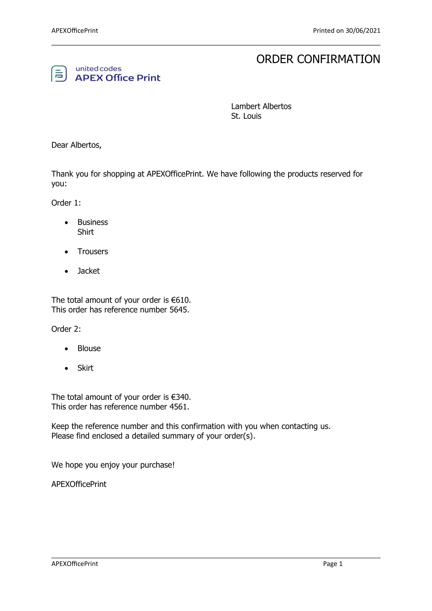
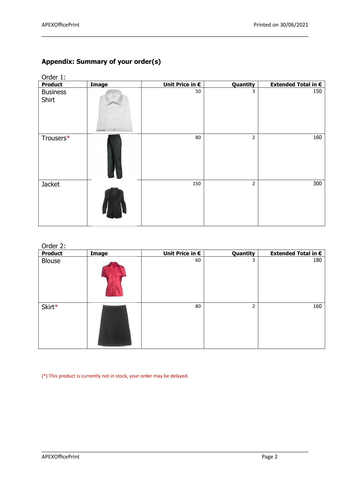
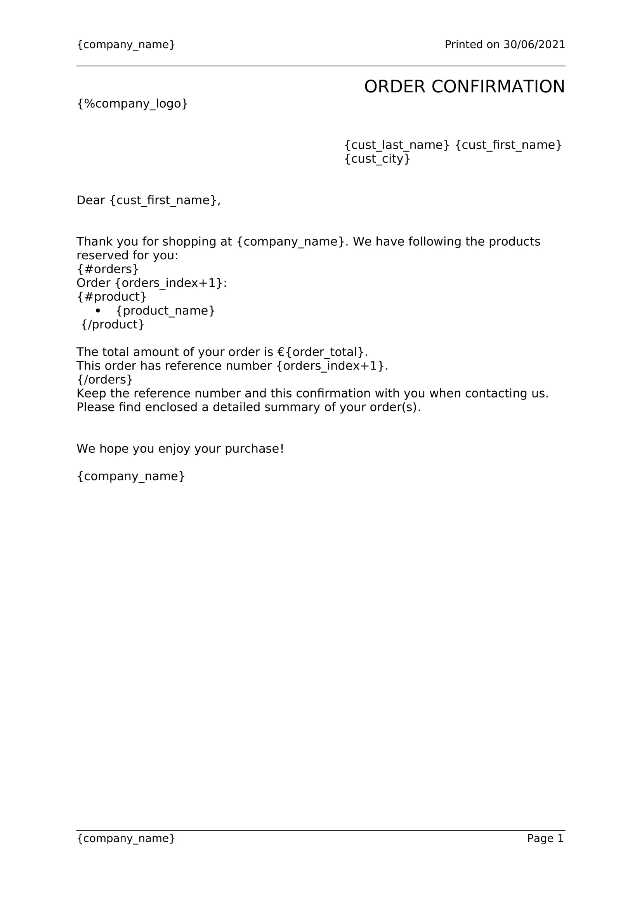

# About
In this example we are going to show you how to use the Python SDK for APEX Office Print. The example we will be using is: generating an order confirmation for buying products from a company. The resulting output file will look like this:




# Template
The template we are using is the following:



## Tags used in this example
- normal tag: {data_string} (e.g. {company_name})
- image tag: {%imageKey} (e.g. {%company_logo})
- loop tag: {#data_loop}...{/data_loop} (e.g. {#orders}...{/orders})
- string/number comparison: {#key=='value'}...{/key=='value'} (e.g. {#in_stock<quantity}...{/in_stock<quantity})
- numerical expression: {num1+num2} (e.g. {unit_price*quantity})

# Data: Python code
```python
import apexofficeprint as aop

TEMPLATE_PATH = "./examples/data/template.docx"
SERVER_URL = "http://localhost:8010"
API_KEY = "1FC7446D926A2E3CE0530100007F2364"

template = aop.Resource.from_local_file(TEMPLATE_PATH)

server = aop.config.Server(
    SERVER_URL,
    aop.config.ServerConfig(api_key=API_KEY)
)

# Main object that includes all the data
data = aop.elements.Object('data')

# Company information
company_name = aop.elements.Property('company_name', 'APEXOfficePrint')
company_logo = aop.elements.Image.from_file('company_logo', './examples/data/logo-office-print.jpg')
company_logo.max_height = 200
company_logo.max_width = 200

## Add company information to data
data.add(company_name)
data.add(company_logo)

# Customer information
cust = aop.elements.Object.from_mapping({
    "cust_city": "St. Louis",
    "cust_first_name": "Albertos",
    "cust_last_name": "Lambert",
})

## Add customer information to data
data.add_all(cust)

# Order information
order_list = []

## Order 1
order1 = aop.elements.Object.from_mapping({
    "order_name": "Order 1",
    "order_total": 610,
    "ref_nb": 5645
})

### Add products for first order

#### First product of first order
product1 = aop.elements.Object.from_mapping({
    "product_name": "Business \nShirt",
    "quantity": 3,
    "unit_price": 50,
    "in_stock": 3,
})

##### Add image for first product
image = aop.elements.Image.from_base64('image', '/9j/4AAQSkZJRgABAQAAAQABAAD/2wCEAAkGBhAQDxINEhQPEw8SEBcVEBQUEBAP\r\nFBAQFBAVFhQQFBQXGyYeFxkjGRISHy8gIygsLCwsFR8xNTwqNSYrLCkBCQoKDQoN\r\nGQwOGikeHBgpNSkpKSk0KSwpKSk0MCw0NSkpKSksMikpLC4wKSwqKSkpKSkpKjQ0\r\nKSkpKjYpNCkyKf/AABEIAGgAaAMBIgACEQEDEQH/xAAbAAACAwEBAQAAAAAAAAAA\r\nAAAABQIDBAEHBv/EADgQAAIBAgMEBgYKAwAAAAAAAAABAgMRBBIhBTFBUWFxgZGx\r\n0RMWIlKhwQYyYnKSorLh8PEUQlP/xAAUAQEAAAAAAAAAAAAAAAAAAAAA/8QAFBEB\r\nAAAAAAAAAAAAAAAAAAAAAP/aAAwDAQACEQMRAD8A9xAAAAA43YDNjdpU6P13Z8Et\r\nW+wX+tFPhGfwQlxSdSrObu7y046cLdli+ns52vu62A19ZIe5LvRbS2/Se9Sj1q/g\r\nJqWCbbXItlhcu9PxXwA+lp1VJZk00+KJCfYtVRk6d1qsy15NLTv+A4AAAAAAAAAA\r\nAwbRx7ptRSV2r3fDsF06spJyk29G10dhbtN3qtckl8/mQy6NdAGLA1LeybZbtDBK\r\ni4u5vjVWXM2kubAoouTk1mk8u9ejyp3XCTWvYzXOqorMyFDFQnua6tz67bzLj53Q\r\nGKlXbrqb0TurLgmtPiOqGJnHc9OT1Qow1FucXykvEcTQDTDVs8VLdzXJotMWzZaS\r\nj037/wCjaAAAAAAACTFK9Sb+14JIjF2O1PrS+8/FnUwMmNxcKavLe90Vq5dSFTwO\r\nIxLTlelT4J3Vl1b2+kfwpxTbSV3vfHvJ5uICWv8ARySSdObutybt8UcpzrR0rQlZ\r\nf7LXvtvHaqABmwltJKzXQamRVJJ3sk+jS/XzJsC/Au0+uIwF1DScevxQxAAAAAAA\r\nBFU+tL7z/UyJ2b9qS+0/1M7YATLEiOQ7GNgJJO/C1tAtqSQAdsQJORyIFkXZp8mv\r\nEZiqW4aRd0nzQHQAAAjOVk29yV32EjNtCpanLp07wEyXEsvYqlVUd/8AP5clU1Vu\r\nene7AXU5XSb32JoruSTAkpq9tL8gcjmVXvxOMCRKKIRZK4EhhhneEerwFqZvwUvY\r\n6m/G/wAwNAAAAL9sJuMdbe1ustdBgKts1NYx6G+/+gF0r3XFX1emnwLL8en5lfpl\r\nxaXaV1MZDRZo3bVldcwNiJJlDrHP8gDSpHGzI8dHNk4/tcs9OBoTJJmZV0WKogLT\r\nbs6Wkl0371+wuzGzZsvaa5rwf7gMQAAAWbU2FCvJTbkmlZ21uuHQuIABi9ScM9+d\r\n9sV8jtP6E4WMlJekTTunmW/uAANi2BT96r+JeRx/R+lzqfiXkAAQ9WaV82arf7y8\r\nifq9T96r+KPkcADvq/D36nfHyBbAj79T8vkAASWxV/0qfl8i3C7OySzZ5PTc0l4A\r\nAG0AAD//2Q==')
product1.add(image)

#### Second product of first order
product2 = aop.elements.Object.from_mapping({
    "product_name": "Trousers",
    "quantity": 2,
    "unit_price": 80,
    "in_stock": 1,
})

##### Add image for second product
image = aop.elements.Image.from_base64('image', '/9j/4AAQSkZJRgABAQAAAQABAAD/2wBDAAkGBwgHBgkIBwgKCgkLDRYPDQwMDRsU\r\nFRAWIB0iIiAdHx8kKDQsJCYxJx8fLT0tMTU3Ojo6Iys/RD84QzQ5Ojf/2wBDAQoK\r\nCg0MDRoPDxo3JR8lNzc3Nzc3Nzc3Nzc3Nzc3Nzc3Nzc3Nzc3Nzc3Nzc3Nzc3Nzc3\r\nNzc3Nzc3Nzc3Nzc3Nzf/wAARCABoAGgDASIAAhEBAxEB/8QAHAABAQACAwEBAAAA\r\nAAAAAAAAAAcBBQQGCAID/8QAPRAAAQMDAAUHCAgHAAAAAAAAAQACAwQFEQYHEiFB\r\nEyIxUWFxoSMygZGxssHRFBUXQnOiwuEINVJiY5Lw/8QAFgEBAQEAAAAAAAAAAAAA\r\nAAAAAAEC/8QAFhEBAQEAAAAAAAAAAAAAAAAAAAEx/9oADAMBAAIRAxEAPwC4IiIM\r\nrCIg02mV2msWi1zulNyRmpad0kYlBLS7gDgjioH9q+mVRkG5RQ/hUkfxBVE1/wBx\r\nmp9GKKgiJaytqgJSOLWDaA/22fUoZAcwskA+9zh2ZPzVSu1yaw9LZRz9IKvH+OKN\r\nvsYvlmmek4eyV16uLwJBzTOQCenBAxuWjiY1swjxuLNof96Av2iZtU+Cd4dg9+Qi\r\nPUdkucN5tNLcaYERVEYeA7pHWD3HIXOU51J10k1jraF7tptLUbUeTvDXjOPWD61R\r\nlGjiiIgIiIMrCIgysIiCOfxCTbQstM3pHKyeLB81HaPPloXjGDnHYVYtfcYdXWVw\r\nbl3JTA92WKPy+Sq439AcC0+1VHMjOWwv+807JXLi3Pdu3Eg56iuJT+cWg8071ywc\r\nIioajpD9PvEY6DFE71F3zVcUj1GRONZeJgeaI4mEdpLj8FXFFhxRERRERAREQZWE\r\nRBJte0flLHN+Oz3Co5eOZG2TGcOHtVs16szbrPJje2qe3Pez9lFrwM0TtyrNYo3Z\r\n2CuaOhauhf5Nh7ls3bgT1DoKCt6iTmkvO7onjH5SqmpdqIwbZd3jjUs9xVFRqHFE\r\nRAREQZWERBlYREEw16Of9WWho8w1Tye8M3fFRqtbtwFvXn2K068o9qzWx+7m1Z3Z\r\n/sKjFUPJFVm61NAc0+OIOFtXzBpZtea9vVxWotxB5RufvLZAcpA0EZLDgoLPqF/k\r\n91B4VTfcCqKleoUn6tu7DwqGe7+yqijRxREQEREBERAREQTjXfHtWC3yZI2azHfl\r\njvkopVHmY61ateJA0ftw4/Th7jlE6l2B6FUutZbqdxp6qdmTyUzGFvDnB5z+VbKl\r\ndtMeR6WkbwU0coZaux6Qzx9FGKed3aNtzT4OJ9C+WO2XZG8ObvCIsGoZ+YL207nc\r\nrC7HYWu+Sq6iOomqLdI7jS7RxLRh5Hax4H6yrco1BE4ogIiICIiAiIgm+vFubBbn\r\ndVaPccofWuPmbO8g4wrlrxZIdGKJ7Gkhla0uPVzHY8VEWkAgzOGT0AqpVE1QWMT6\r\nFaWzSAbdYx1MMjOyGxkjxf4Kd0+HxjaG9vR3KxainNqtGbzGHDZdXubu4Dk2BSSo\r\npH2+4VFHNukp3uid3tOPgg7hqdcINPI2jOZaWVvsd+lX1eeNVTj9odvA382UHu5N\r\ny9DqEETiiKIiICIiAiIg1mktlh0hsdVaql7o46hoBe0AluCCDv7QugQalLYJM1F3\r\nrXs/pjYxnjvREHdNEtEbXolST09qExE8nKSvmk2nOOMDqHgpppdq20irdIq2uoI6\r\nSaCpnfK3E+y5oJzghwHhlEQdh1eatn2G4C8XeoD65meRihflke00g7Rxzjv7h2qk\r\nIiAiIgIiIP/Z')
product2.add(image)

#### Third product of first order
product3 = aop.elements.Object.from_mapping({
    "product_name": "Jacket",
    "quantity": 2,
    "unit_price": 150,
    "in_stock": 3,
})

##### Add image for third product
image = aop.elements.Image.from_base64('image', '/9j/4AAQSkZJRgABAQAAAQABAAD/2wCEAAkGBhQSDRUTExQTExIWFBMZERgVERAV\r\nEhkXExAWGRwVFxQYGygeIxkvHxgUHzAgJTMsLiwsFR4xNTEqNSYrLSsBCQoKBQUF\r\nDQUFDSkYEhgpKSkpKSkpKSkpKSkpKSkpKSkpKSkpKSkpKSkpKSkpKSkpKSkpKSkp\r\nKSkpKSkpKSkpKf/AABEIAGgAaAMBIgACEQEDEQH/xAAcAAEAAgMBAQEAAAAAAAAA\r\nAAAABwgDBAYFAgH/xAA1EAABBAEBBQUGBQUBAAAAAAABAAIDEQQhBQYHEmEiMVGB\r\nkRMUQXGhwSMyQ5KxQmRyk6Iz/8QAFAEBAAAAAAAAAAAAAAAAAAAAAP/EABQRAQAA\r\nAAAAAAAAAAAAAAAAAAD/2gAMAwEAAhEDEQA/AJxREQEREBERARLRAREQEREBERAR\r\nEQEReDv1lui2VkvY4seIjyuBogkgaHx1QaW8nErEw3FhLpZRoWRgGj4OcTQPTU9F\r\nFO+PFjJyXM9g5+KxpvljkdzOsD87xXXRcdJMStO7dqg6s7/5/JXvMw79fauJojrr\r\na9/cjivJjSPZmyTZELq5Do+Rhs3q42W9L+Sj+9PJak8mtoLSbv754mb/AOEoc4Cy\r\nxwLJAPHldqR1Fhe2qn7Mz3xSNkjcWPaba5poghWm2VkmTGikNW+ONxrutzATXqg2\r\nkREBERAREQFynFGYN2Jk3pbWAdS6ZgpdWo2455/Ls+KO9ZJga8RGx30tzPogg9x7\r\n1gL1+6l7qBIa3tGtBqBZ8zXmsTe9BmbNpXosbBZX41pJ+GgWVjKKDMDQVndycjn2\r\nTiO77x4v+YwPsquTS9to6X6lWK4Q7QEmxomjvidJG7585eK6U9qDtEREBERAREQF\r\nBvHLaYdtCOMO5hFDq0EGnSPJN9eUMU5FVg37yPabWy3lv68gFaaMdya/tQaWy8a8\r\nDNl+A90b0t+Q416MXjwnVdXs+Et3cyZCCBLnY7WE9x9lE9xr5W5cswIMkQ7z1+wX\r\n04ar5iOh+evoF++zsoNna2zOSHFyG/llbMx1n9SCZ16eHI+L6qRuBu3XNy34xP4c\r\nrC9os0Hx1qB1bd/4jwXH5GI6TYgcAXDGzO1VmmZUIFnwbzxN83rY4ZZRZtnFN1cn\r\nL+9jm19UFlkREBERAREQCqv759nauYP7mf6yuP3VoFE21eEE+TtLImdLFFDJK5za\r\nDnyUa/poC/NBzm+Lmx7ubKiboHsfK4eLi0En1kd6qO7UhcXoxDNi4bXFzMfEYATV\r\n25zhZrS6Y1Ry96D6jJ1+Z+yyNdqteA9nzP8AAWTmQdvujT9i7WYTX4GO8fHWOV7v\r\n5DR5rxdy7G08TTX3nHr/AHsXW8DcZkuTlxSta+N+O0Oa4W0tEutjzXYjg9HFtGDJ\r\nxpC2JkzHvikt1Bpv8N/f3gaO9UEjoiICIiAiIgIiIIt4mcLZszJOVjva5xY1r43n\r\nlPYFAsd3eRr56qKNqbhZ8JIkxJ/m2MyN/dHYVqUQVbh4dZ3uL8o48gY1zRyljhMW\r\nkG5BHXNyjs69b7gSseztx86bVmJOR4mMsb6voK1CIIs4R8PcrCyJcjJDY+eL2bGB\r\n4c/V7XFzuXsj8tVfx+ClNEQEREBERAREQEREBERAREQEREBERAREQf/Z')
product3.add(image)

#### Add products to order1
products = aop.elements.ForEach('product', [product1, product2, product3])
order1.add(products)

## Order 2
order2 = aop.elements.Object.from_mapping({
    "order_name": "Order 2",
    "order_total": 340,
    "ref_nb": 4561
})

### Add products for second order

#### First product of second order
product1 = aop.elements.Object.from_mapping({
    "product_name": "Blouse",
    "quantity": 3,
    "unit_price": 60,
    "in_stock": 10,
})

##### Add image for first product
image = aop.elements.Image.from_base64('image', '/9j/4AAQSkZJRgABAQAAAQABAAD/2wCEAAkGBhAQEBUSExIVFBMWFRIUFxYUGBoU\r\nFxcXGRYYFRgcGhIXICYfFyUlGRcTIS8gJCgpLC0sFx4xNTAqNSk3LCkBCQoKDgwO\r\nGQ8PGiwkHiItKi0vLDU1NSw1Li0vKTQpKSk1KyorNTU1KiwpKSwqNC0sKTQsLSws\r\nLCwpLCw0LCw1LP/AABEIAGgAaAMBIgACEQEDEQH/xAAcAAEAAgMAAwAAAAAAAAAA\r\nAAAABgcDBAUBAgj/xAA3EAABAwIDBAYIBgMAAAAAAAABAAIRAwQSITEHQVFxBQYT\r\nYaHBIiMyQnKBkbEUkqKjstFSYoL/xAAaAQEAAgMBAAAAAAAAAAAAAAAAAwYCBAUB\r\n/8QAJxEAAgICAgADCQAAAAAAAAAAAAECAwQRBRIhMUETIkJRYYGR4fD/2gAMAwEA\r\nAhEDEQA/ALxREQBERAERQfrBtVtrW5Nu2m6qW+05rgGh0xhGRxEQZ+i83okrqna9\r\nQWycIq6qbZKAE/h3/mE+IiVMugOsFC9oitRdLTqDk5piYc3cUTTM7ca2pbnHR00R\r\nF6QBERAEREAREQBcPp3rjaWZw1HkvicDGl7oOkxk2YOpC7ZXz90t0qatzUrH2qlS\r\no6ODQS1on4WtHyWMno3sHGWRNqT8ESTrRtZuHMcKNPsaZBGN3pVSNJEZM1AnPuKg\r\nVhQrvaXPA0kDeAc447966Bql0mZacu8c1lt3mdAMomdY7lC5MtNGHVS/cOUORPcN\r\nSs3QPWS8sKwcPVlwAAgFhbOTXt7tx1GfGVv2tENfU4YgByifPwWK8oYm4d5B+u5F\r\nImuojbHUiyui9rVLJtzRdTOXp0/WMO45e03P4uandrdMqsbUY4OY4BzXDQgqhLam\r\nKjG8PR7yJEnzVnbNrr1T6MmGODmzuDtR9RP/AEs4z29M4HIcdCqDtr/BM0RFKcEI\r\niIAiIgMF/dClSfUIkMY98ccILvJfM76xMnSc48T4r6M6zWtWrZ16VEA1H0nsbJgS\r\n4YdeRKo7pfqRf29Nzn21RxDdaY7UftzGvDcsJHX42UY9tvTPSgC5gIwhrmg9/f4r\r\n3DIGU8Z3fRcSxu8LWNIOMyIPuy4g5HTUqUXVcNafRncAtdrRaKrFKO0ak8DMxnos\r\nj6GIaHLQx5Lxd0iMIYcJg6GM8oWwK7xSLj7QgnzXhNs51gx1OsRIwmXjuI1y5OKn\r\nuzy9BuyGmQ6m8ZcWlpj5earptW4ubgNo0X1HsqEEUmkns51JHs6DM8VY3V3qXfUL\r\nujXAbTptPrGPfLnBwIMNaCARPEZhSxi9pnKzr6/Yzg2t/IspERTlPCIiAIiIAiIg\r\nKN2n2Rb01iOj6VF4+Us+7VhqNmmeRUx2uWDJtq8+mHVKUcWkB+vcW/rKgd3cODIB\r\njcVr2eZb+LlvHTN6mAcPL+l7VWTTqD/U/wBrBQPsmZkDktymBiI4gjwUR1vQ6exy\r\nzP4y8qbuztx83y4/xVtBQfZRbsbb1T75qw7k1oDfu5TlbcfIo+e95EwiIsjSCIiA\r\nIiIAiLwUBVO1XpXHd06IOVJmI/E+D4Na38yheEuDnboWz1ju+2vLipxq1I+Friwf\r\npAWvSE0ncIK15PxLnhV9KYx+htPYYycdMuII71lsb3FhJ13rVovh4aSYOUb93HRK\r\ntDsn65EyFGb+/Un+zi9wXFagffhw5ifIn6Kxgqj6v1sN1RqjeWA8icP2JVuBbFb2\r\niq8vV0v7L4l+giIpDjhERAEREAXgleV4IlAfODvSJJOrnE/MyvWtUJaWN4H7K5bn\r\nZh0e90hj6fcx5Dfk10gchksJ2T9HnXtSOHaQDzgKHoyyQ5SlR1plQ21US0ndnJ1P\r\nMruXlDGIyxaiVYzNlvRw9x8f44zH2nxWw3Z1YAAYKkD2fWP9HkZleOtsmjzFEfBp\r\n/wB9yu+hqhBYM5a9v8grqC41n1Os6RBFKSDIL3OfnxgmPBdoLOEepyORzIZUouCa\r\n0ERFIcwIiIAiIgCIiAIiIAiIgCIiAIiIAiIgP//Z')
product1.add(image)

#### Second product of second order
product2 = aop.elements.Object.from_mapping({
    "product_name": "Skirt",
    "quantity": 2,
    "unit_price": 80,
    "in_stock": 1,
})

##### Add image for second product
image = aop.elements.Image.from_base64('image', '/9j/4AAQSkZJRgABAQAAAQABAAD/2wBDAAkGBwgHBgkIBwgKCgkLDRYPDQwMDRsU\r\nFRAWIB0iIiAdHx8kKDQsJCYxJx8fLT0tMTU3Ojo6Iys/RD84QzQ5Ojf/2wBDAQoK\r\nCg0MDRoPDxo3JR8lNzc3Nzc3Nzc3Nzc3Nzc3Nzc3Nzc3Nzc3Nzc3Nzc3Nzc3Nzc3\r\nNzc3Nzc3Nzc3Nzc3Nzf/wAARCABoAGgDASIAAhEBAxEB/8QAHAAAAQQDAQAAAAAA\r\nAAAAAAAAAAIDBwgBBAUG/8QAPBAAAQMCAwIKCAMJAAAAAAAAAQACAwQRBQYhBzES\r\nExRhcYKhscHCIjJBUXKBkdIzUpJCRVRzg5SistH/xAAUAQEAAAAAAAAAAAAAAAAA\r\nAAAA/8QAFBEBAAAAAAAAAAAAAAAAAAAAAP/aAAwDAQACEQMRAD8AnFCEIBebxjO2\r\nDYNib8Pr5JmSsa1xc2IuaLi43a9i9Iq77Qq11Xm7FJGuBDZjGOhgDfBBMUefssSf\r\nvVjPjje3vatuPN2XJPVxug607R3qtjpX+3vSDO/n+qCzJzVl4b8cw7+5Z/1NPzjl\r\ntgu7HKA/DMD3KtPKHD3/AFWOPfaw70Fi5toWVohrirX/AMuJ7u5qXg+esDxnEosP\r\noJZnzShxbwoS0aAk6nmCroyRxbqQPmu5k6uNDmfC6kv4LWVLA4j8pPBPYSgsqhCE\r\nAhCEAhCEDdRK2CCSZ/qxtLj0AXVXa6Z09RJM83dI4vcecm5VjM6VPJMqYrKDY8me\r\n0dLhwR3qt0x9IoNd6QUtybKBJb7kDRK9iwgy06rZhJBu02PsPOtUJ+LegtLg9YMQ\r\nwmirAb8fAyT6tBW4vJ7LavlWSqEE3dCXwnquNuwhesQCEIQCEIQeO2r1HEZOnYDb\r\njpY2dvC8qgKU6qadtVRwMGoIL/iVBf8ApaR5lCsm9A2d6bcllJcgwNywd6yNyQ46\r\noFBPRGyZTjCgm7YnU8ZgVdTE6xVXCHQ5o8WlSMoh2G1Nq7FKUn14Y5APhJHmCl5A\r\nIQhAIQhBEm22ovW4bTfkhe89YgeVRTIVIO2Go43NRjv+FTxt73eZR7KgRdYWAUOK\r\nBJNk2TcrL0m6BwFONOqZultcgkHY7VGDOMcd9J6eSPsDvKp4VbNn9VyXOGEy3sDU\r\nNYTzO9HzKyaAQhCAQhCCve0qo5RnDE3X0bIGDqtA8F5CUrtZqqeVZgxKYG4fVSuH\r\nRwiuHJuQNgocdEkb0E6IEuKQCLrLtyQN6BwmwCUwptx0ASo9EHRw2c01ZBUNNjFI\r\n2QfIg+CtWxwexr2m4cLjoVTIvWA96tDleo5XlvC6i9zJSRE9PBF0HUQhCATVVKIK\r\naWZ26NhefkLp1cfN8/J8rYtLexFJIAectI8UFbKhxkkc929xuVqyLekjIJ00Wq6M\r\n2Qa1tVgjRPGMrHFm2iDXcNEkNWwYiVjiigYOruZLYNU7xJShERuQEfrBWM2YVHKM\r\nkYab3MbXxnqvcO6yruyIg3sVO+xt5dlJ7CdGVcgHQQ0+KD3aEIQCTJGyVjmSsa9j\r\nhYtcLg/JCEHCxDJeXcQuZ8Kga4/tQgxH/Gy402yzLkjrtFZGPc2e47QUIQMu2TZe\r\nO6fEB/VZ9qbOyPAv4zEP1x/YhCBJ2Q4JfSvxD6x/alDZHgI31mIHrx/YhCB1uyfL\r\no3y17umZvg1blPszyvCPTo5pj75Kh/gQhCDpUuS8t0rg6LBqThDUF7OH/tdd1jGx\r\nsDI2hrRoGtFgEIQKQhCD/9k=')
product2.add(image)

#### Add products to order2
products = aop.elements.ForEach('product', [product1, product2])
order2.add(products)

## Add order_list to an object list
orders = aop.elements.ForEach('orders', [order1, order2])

## Add orders to data
data.add(orders)

# Merge template and data to generate the output file
conf = aop.config.OutputConfig('pdf') # Optional
printjob = aop.PrintJob(template, data, server, conf)

try:
    res = printjob.execute()
    res.to_file("./examples/output/output") # Save response to output file
except aop.exceptions.AOPError as err:
    print('AOP error:', err)

```