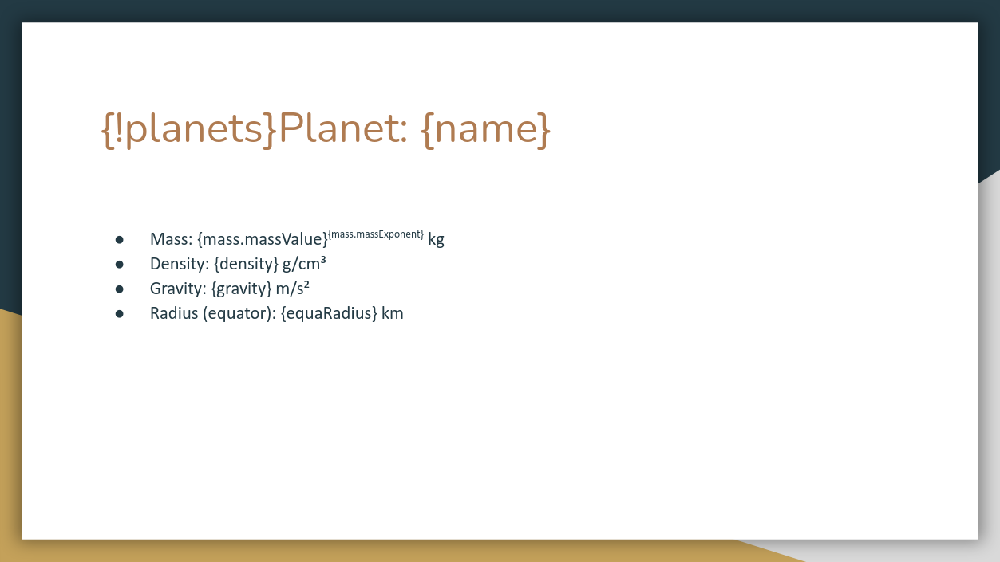
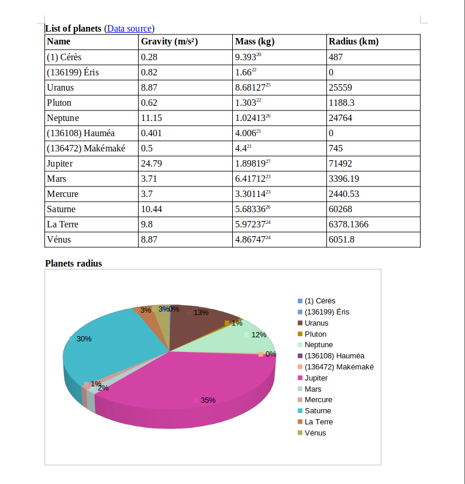

# About
In this file we are going to show you how you can use this APEX Office Print (AOP) SDK to generate an output file using a template and data to fill the template. The general approach is to create a template file in which you want the data to appear, then process the data with this SDK and finally let APEX Office Print do the work to merge your template with the data. 

In this example, we are going to use solar system data to fill a template we are going to make. The solary system data can be received by sending an HTTP-request to an API. The API used in this example is https://api.le-systeme-solaire.net.

Normally you know the data you will be using to fill in the template, but for this example, we are going to start with a brief overview of the data we will be using. Then we will create a template. Then we will get the data from the solar system API and process this data with this SDK. Finally we send the template together with the data to an AOP server and save the response into our output file.

# Input data (API)
The data we use comes from https://api.le-systeme-solaire.net. The data that interests us is about the bodies of the solar system and more specifically the planets and dwarf planets in our solar system. If we go to the URL https://api.le-systeme-solaire.net/rest/bodies, we retrieve a JSON array containing objects for each body in the solar system. One such object may look like this:

```json
{
    "id":"lune",
    "name":"La Lune",
    "englishName":"Moon",
    "isPlanet":false,
    "moons":null,
    "semimajorAxis":384400,
    "perihelion":363300,
    "aphelion":405500,
    "eccentricity":0.05490,
    "inclination":5.14500,
    "mass":{
        "massValue":7.34600,
        "massExponent":22
    },
    "vol":{
        "volValue":2.19680,
        "volExponent":10
    },
    "density":3.34400,
    "gravity":1.62000,
    "escape":2380.00000,
    "meanRadius":33.00000,
    "equaRadius":1738.10000,
    "polarRadius":1736.00000,
    "flattening":0.00120,
    "dimension":"",
    "sideralOrbit":27.32170,
    "sideralRotation":655.72800,
    "aroundPlanet":{
        "planet":"terre",
        "rel":"https://api.le-systeme-solaire.net/rest/bodies/terre"
    },
    "discoveredBy":"",
    "discoveryDate":"",
    "alternativeName":"",
    "axialTilt":6.68,
    "avgTemp":0,
    "mainAnomaly":0.00000,
    "argPeriapsis":0.00000,
    "longAscNode":0.00000,
    "rel":"https://api.le-systeme-solaire.net/rest/bodies/lune"
}
```

# Template
Now we will build the template. We can create templates in different file extensions, namely docx, xlsx, pptx, html, md, txt and csv. In this example we will build a template of filetype pptx and docx. The template has to follow a specific structure which can be found at the official AOP documentation: https://www.apexofficeprint.com/docs/.

## pptx
We will build the template in Google Slides. After choosing a pretty theme, we create the title slide. On this slide, we want the title of our presentation and the source where we got the data from. The title slide looks like this:


<!-- TODO: change this link to Github link -->

Here we encounter our first placeholder/tag: `{*data source}`. Tags are defined by surrounding a variable name with curly brackets. This is the way we let the AOP server know that data needs to replace this placeholder. We will see what that data is in the section [Process input data](#process-input-data). In this specific case, we used a hyperlink-tag `{*hyperlink}`.

Note: to minimize the modifications to the input data (see [Input Data (API)](#input-data-api)), it is important to use as variable names the keys available in the input data if possible.

Next, we want to have a slide for each planet with information about this planet. Since all planets have the same parameters (such as mass, density, gravity etc.), we want to specify one template slide and use this for each planet. This template slide looks like this:


<!-- TODO: change this link to Github link -->

Again, the placeholders will be replaced with data by the AOP server. Since the data given to the AOP server will be in JSON-format (see [Process input data](#process-input-data)), it is possible to reach a subfield of an entry by using `entry.subfield`. So if `mass` is a JSON object like this:
```json
"mass": {
    "massValue": ...,
    "massExponent": ...
}
```
we can access the field `massValue` by doing `mass.massValue`, as can be seen on the slide. The tags on this slide are 'normal' tags in the sense that they will just be replaced by a value.

The thing of replicating a certain template slide for each object in a list is exactly what the first tag `{!planets}` is for. For each planet in the planets-array (provided in the data, see [Process input data](#process-input-data)), this slide is repeated.

It might be interesting to plot the radius for each of the planets on a chart. This is the slide used for that:


<!-- TODO: change this link to Github link -->

The tag `{$planet_radius_chart}` is used to insert a chart at the place of this placeholder. The data for the chart can be generated using this SDK.

## docx
The template for the "docx"-filetype is very similar to the template for the "pptx"-filetype in the sense that they use the same parameters. For this template we want to generate a table containing information about the planets in the solar system. The template looks like this:


<!-- TODO: change this link to Github link -->

# Process input data (SDK)
Now that our template is finished, we have to process the data used by the template. That is where this SDK comes into play. In this section we will explain in detail all the code needed to generate the data to fill in the template. The full code can also be found in the example file itself.

The beauty of AOP is that the data created by the Python SDK can be used in all templates of different file extensions while using the same tags.

## Setup
First we create a new file and import the APEX Office Print library:
```python
import apexofficeprint as aop
import requests
```
Then we need to set up the AOP server where we will send our template and data to:
```python
SERVER_URL = "https://api.apexofficeprint.com/"
API_KEY = "YOUR_API_KEY"  # Replace by your own API key

server = aop.config.Server(
    SERVER_URL,
    aop.config.ServerConfig(api_key=API_KEY)
)
```
If you have an AOP server running on localhost (e.g. on-premise version), replace the server url by the localhost url: http://localhost:8010

We also need to create the main element-collection object that contains all our data:
```python
data = aop.elements.ElementCollection()
```

## Import data
As discussed in [Input data (API)](#input-data-api), we use an API of a cloud server to receive the data about the planets. The information we use for this example can be received as follows:
```python
res = requests.get('https://api.le-systeme-solaire.net/rest/bodies/').json()
```

## Title slide
The template title slide contains a normal tag for the title `{main_title}` and a hyperlink-tag `{*data_source}`. Now we need to add the data for these tags in our code by creating an AOP element (property and hyperlink) and adding this to the main data collection:
```python
# Add the title to the data
data.add(aop.elements.Property('main_title', 'The solar system'))

# Add the source for the data
data.add(aop.elements.Hyperlink(
    name='data_source',
    url='https://api.le-systeme-solaire.net/rest/bodies/',
    text='Data source'
))
```
The tag `{main_title}` will be replaced by 'The solar system' and the tag `{*data_source}` will be replaced by the text 'Data source' and this text will have a hyperlink to the URL 'https://docs.spacexdata.com'.

## Planets
The data for the planets needs to be put in a loop-element so that the AOP server can iterate over all the planets. We also process the body-array so that we only have the bodies that are planets in our data.
```python
planet_list = []

for body in res['bodies']:
    if body['isPlanet']:
        collec = aop.elements.ElementCollection.from_mapping(body)

        planet_list.append(collec)

planets = aop.elements.ForEach('planets', planet_list)
data.add(planets)
```

## Chart
Finally we need to add the data for the planet radius chart. A chart consists of one or more data series. We want the chart to be a 3D pie chart, so we first create a `PieSeries` with the name of the planets on the x-axis and their radius on the y-axis. 
```python
# We specify the color of the first pie slice
color = [None for _ in planet_list]
color[0] = '#7298d4'

radius_series = aop.elements.PieSeries(
    x=[planet['name'] for planet in planets.as_dict['planets']],
    y=[planet['meanRadius'] for planet in planets.as_dict['planets']],
    name='radius',
    colors=color
)
```
We then create options for the pie chart. We disable the border around the chart and specify the color of the chart legend's text:
```python
radius_chart_options = aop.elements.ChartOptions(
    border=False
)

radius_chart_options.set_legend(
    style=aop.elements.ChartTextStyle(
        color='black'
    )
)
```
Finally, we create the 3D pie chart itself and add it to the element collection:
```python
# Create the 3D pie chart
radius_chart = aop.elements.Pie3DChart(
    name='planet_radius_chart',
    pies=(radius_series,),
    options=radius_chart_options
)
data.add(radius_chart)
```

# AOP server and response
Now that we have the template and the data ready, it is time to let AOP merge them together. In the SDK this is implemented by creating a print job:
```python
printjob = aop.PrintJob(
    data=data,
    server=server,
    template=aop.Resource.from_local_file(
        './examples/solar_system_example/pptx/solar_system_template.pptx'),  # pptx
    # template=aop.Resource.from_local_file('./examples/solar_system_example/docx/solar_system_template.docx'),  # docx
)
```
We loaded the template from a local file and passed in our data element collection and our server object.

Finally we actually send this printjob to an AOP server and save the response into our output file:
```python
printjob.execute().to_file('./examples/solar_system_example/pptx/output')
# printjob.execute().to_file('./examples/solar_system_example/docx/output')
```
The resulting file can now be found in the specified folder.

# Result
For the "pptx" output file, we will not add the result in this text, but the output file can be found in the folder of this example. The "docx" output file will look like this:


<!-- TODO: change this link to Github link -->