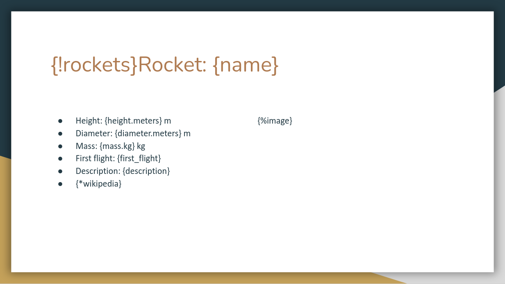

# About
In this file we are going to show you how you can use the APEX Office Print (AOP) Python SDK to generate an output file using a template and data to fill the template. The general approach is to create a template file in which you want the data to appear, then process the data with the Python SDK and finally let APEX Office Print do the work to merge your template with the data. 

In this example, we are going to use SpaceX data to fill a template we are going to made. The SpaceX data can be received by sending an HTTP-request to an API. The (non-official) API used in this example is https://docs.spacexdata.com/.

Normally you know the data you will be using to fill in the template, but for this example, we are going to start with a brief overview of the data we will be using. Then we will create a template. Then we will get the data from the spacexdata-API and process this data with this Python SDK. Finally we send the template together with the data to an AOP server and save the response into our output file.

# Input data (API)
The data we use comes from https://docs.spacexdata.com/. More specifically we will use SpaceX data about their company, rockets, dragons, launch pads, landing pads and ships that assist SpaceX launches. Let us have a look at the available data for the different components.

## Company
Link: https://api.spacexdata.com/v3/info

The response is a JSON with information about the company SpaceX:
```json
{
   "name":"SpaceX",
   "founder":"Elon Musk",
   "founded":2002,
   "employees":7000,
   "vehicles":3,
   "launch_sites":3,
   "test_sites":1,
   "ceo":"Elon Musk",
   "cto":"Elon Musk",
   "coo":"Gwynne Shotwell",
   "cto_propulsion":"Tom Mueller",
   "valuation":27500000000,
   "headquarters":{
      "address":"Rocket Road",
      "city":"Hawthorne",
      "state":"California"
   },
   "links":{
      "website":"https://www.spacex.com/",
      "flickr":"https://www.flickr.com/photos/spacex/",
      "twitter":"https://twitter.com/SpaceX",
      "elon_twitter":"https://twitter.com/elonmusk"
   },
   "summary":"SpaceX designs, manufactures and launches advanced rockets and spacecraft. The company was founded in 2002 to revolutionize space technology, with the ultimate goal of enabling people to live on other planets."
}
```

## Rockets
Link: https://api.spacexdata.com/v4/rockets

The response is a JSON array with information about all the rockets. One element of that array looks like this:
```json
{
    "height":{
        "meters":22.25,
        "feet":73
    },
    "diameter":{
        "meters":1.68,
        "feet":5.5
    },
    "mass":{
        "kg":30146,
        "lb":66460
    },
    "first_stage":{
        "thrust_sea_level":{
        "kN":420,
        "lbf":94000
        },
        "thrust_vacuum":{
        "kN":480,
        "lbf":110000
        },
        "reusable":false,
        "engines":1,
        "fuel_amount_tons":44.3,
        "burn_time_sec":169
    },
    "second_stage":{
        "thrust":{
        "kN":31,
        "lbf":7000
        },
        "payloads":{
        "composite_fairing":{
            "height":{
                "meters":3.5,
                "feet":11.5
            },
            "diameter":{
                "meters":1.5,
                "feet":4.9
            }
        },
        "option_1":"composite fairing"
        },
        "reusable":false,
        "engines":1,
        "fuel_amount_tons":3.38,
        "burn_time_sec":378
    },
    "engines":{
        "isp":{
        "sea_level":267,
        "vacuum":304
        },
        "thrust_sea_level":{
        "kN":420,
        "lbf":94000
        },
        "thrust_vacuum":{
        "kN":480,
        "lbf":110000
        },
        "number":1,
        "type":"merlin",
        "version":"1C",
        "layout":"single",
        "engine_loss_max":0,
        "propellant_1":"liquid oxygen",
        "propellant_2":"RP-1 kerosene",
        "thrust_to_weight":96
    },
    "landing_legs":{
        "number":0,
        "material":null
    },
    "payload_weights":[
        {
        "id":"leo",
        "name":"Low Earth Orbit",
        "kg":450,
        "lb":992
        }
    ],
    "flickr_images":[
        "https://imgur.com/DaCfMsj.jpg",
        "https://imgur.com/azYafd8.jpg"
    ],
    "name":"Falcon 1",
    "type":"rocket",
    "active":false,
    "stages":2,
    "boosters":0,
    "cost_per_launch":6700000,
    "success_rate_pct":40,
    "first_flight":"2006-03-24",
    "country":"Republic of the Marshall Islands",
    "company":"SpaceX",
    "wikipedia":"https://en.wikipedia.org/wiki/Falcon_1",
    "description":"The Falcon 1 was an expendable launch system privately developed and manufactured by SpaceX during 2006-2009. On 28 September 2008, Falcon 1 became the first privately-developed liquid-fuel launch vehicle to go into orbit around the Earth.",
    "id":"5e9d0d95eda69955f709d1eb"
}
```

## Dragons
Link: https://api.spacexdata.com/v4/dragons

The response is a JSON array with information about all the dragons. One element of that array looks like this:
```json
{
    "heat_shield":{
        "material":"PICA-X",
        "size_meters":3.6,
        "temp_degrees":3000,
        "dev_partner":"NASA"
    },
    "launch_payload_mass":{
        "kg":6000,
        "lb":13228
    },
    "launch_payload_vol":{
        "cubic_meters":25,
        "cubic_feet":883
    },
    "return_payload_mass":{
        "kg":3000,
        "lb":6614
    },
    "return_payload_vol":{
        "cubic_meters":11,
        "cubic_feet":388
    },
    "pressurized_capsule":{
        "payload_volume":{
        "cubic_meters":11,
        "cubic_feet":388
        }
    },
    "trunk":{
        "trunk_volume":{
        "cubic_meters":14,
        "cubic_feet":494
        },
        "cargo":{
        "solar_array":2,
        "unpressurized_cargo":true
        }
    },
    "height_w_trunk":{
        "meters":7.2,
        "feet":23.6
    },
    "diameter":{
        "meters":3.7,
        "feet":12
    },
    "first_flight":"2010-12-08",
    "flickr_images":[
        "https://i.imgur.com/9fWdwNv.jpg",
        "https://live.staticflickr.com/8578/16655995541_078768dea2_b.jpg",
        "https://farm3.staticflickr.com/2815/32761844973_4b55b27d3c_b.jpg",
        "https://farm9.staticflickr.com/8618/16649075267_d18cbb4342_b.jpg"
    ],
    "name":"Dragon 1",
    "type":"capsule",
    "active":true,
    "crew_capacity":0,
    "sidewall_angle_deg":15,
    "orbit_duration_yr":2,
    "dry_mass_kg":4200,
    "dry_mass_lb":9300,
    "thrusters":[
        {
        "type":"Draco",
        "amount":18,
        "pods":4,
        "fuel_1":"nitrogen tetroxide",
        "fuel_2":"monomethylhydrazine",
        "isp":300,
        "thrust":{
            "kN":0.4,
            "lbf":90
        }
        }
    ],
    "wikipedia":"https://en.wikipedia.org/wiki/SpaceX_Dragon",
    "description":"Dragon is a reusable spacecraft developed by SpaceX, an American private space transportation company based in Hawthorne, California. Dragon is launched into space by the SpaceX Falcon 9 two-stage-to-orbit launch vehicle. The Dragon spacecraft was originally designed for human travel, but so far has only been used to deliver cargo to the International Space Station (ISS).",
    "id":"5e9d058759b1ff74a7ad5f8f"
}
```

## Launch pads
Link: https://api.spacexdata.com/v4/launchpads

The response is a JSON array with information about all the launchpads. One element of that array looks like this:
```json
{
    "images":{
        "large":[
            "https://i.imgur.com/7uXe1Kv.png"
        ]
    },
    "name":"VAFB SLC 3W",
    "full_name":"Vandenberg Space Force Base Space Launch Complex 3W",
    "locality":"Vandenberg Space Force Base",
    "region":"California",
    "timezone":"America/Los_Angeles",
    "latitude":34.6440904,
    "longitude":-120.5931438,
    "launch_attempts":0,
    "launch_successes":0,
    "rockets":[
        "5e9d0d95eda69955f709d1eb"
    ],
    "launches":[
        
    ],
    "details":"SpaceX's original west coast launch pad for Falcon 1. It was used in a static fire test but was never employed for a launch, and was abandoned due to range scheduling conflicts arising from overflying other active pads.",
    "status":"retired",
    "id":"5e9e4501f5090910d4566f83"
}
```

## Landing pads
Link: https://api.spacexdata.com/v4/landpads

The response is a JSON array with information about all the landpads. One element of that array looks like this:
```json
{
    "images":{
        "large":[
            "https://i.imgur.com/KHBk6jO.png"
        ]
    },
    "name":"LZ-1",
    "full_name":"Landing Zone 1",
    "type":"RTLS",
    "locality":"Cape Canaveral",
    "region":"Florida",
    "latitude":28.485833,
    "longitude":-80.544444,
    "landing_attempts":18,
    "landing_successes":17,
    "wikipedia":"https://en.wikipedia.org/wiki/Landing_Zones_1_and_2",
    "details":"SpaceX's first east coast landing pad is Landing Zone 1, where the historic first Falcon 9 landing occurred in December 2015. LC-13 was originally used as a launch pad for early Atlas missiles and rockets from Lockheed Martin. LC-1 was later expanded to include Landing Zone 2 for side booster RTLS Falcon Heavy missions, and it was first used in February 2018 for that purpose.",
    "launches":[
        "5eb87cefffd86e000604b342",
        "5eb87cf9ffd86e000604b349",
        "5eb87cfeffd86e000604b34d",
        "5eb87d01ffd86e000604b350",
        "5eb87d03ffd86e000604b352",
        "5eb87d07ffd86e000604b356",
        "5eb87d09ffd86e000604b358",
        "5eb87d0effd86e000604b35c",
        "5eb87d10ffd86e000604b35e",
        "5eb87d13ffd86e000604b360",
        "5eb87d26ffd86e000604b371",
        "5eb87d2dffd86e000604b376",
        "5eb87d35ffd86e000604b37a",
        "5eb87d36ffd86e000604b37b",
        "5eb87d42ffd86e000604b384",
        "5eb87d47ffd86e000604b38a",
        "5f8399fb818d8b59f5740d43",
        "600f9b6d8f798e2a4d5f979f"
    ],
    "status":"active",
    "id":"5e9e3032383ecb267a34e7c7"
}
```

## Ships
Link: https://api.spacexdata.com/v4/ships

The response is a JSON array with information about all the ships. One element of that array looks like this:
```json
{
    "legacy_id":"AMERICANCHAMPION",
    "model":null,
    "type":"Tug",
    "roles":[
        "Support Ship",
        "Barge Tug"
    ],
    "imo":7434016,
    "mmsi":367020820,
    "abs":571252,
    "class":7604342,
    "mass_kg":266712,
    "mass_lbs":588000,
    "year_built":1976,
    "home_port":"Port of Los Angeles",
    "status":"",
    "speed_kn":null,
    "course_deg":null,
    "latitude":null,
    "longitude":null,
    "last_ais_update":null,
    "link":"https://www.marinetraffic.com/en/ais/details/ships/shipid:434663/mmsi:367020820/imo:7434016/vessel:AMERICAN_CHAMPION",
    "image":"https://i.imgur.com/woCxpkj.jpg",
    "launches":[
        "5eb87cdeffd86e000604b330",
        "5eb87cdfffd86e000604b331"
    ],
    "name":"American Champion",
    "active":false,
    "id":"5ea6ed2d080df4000697c901"
}
```

# Template
Now we will build the template. We can create templates in different file extensions, namely docx, xlsx, pptx, html, md, txt and csv. In this example we will build a template of filetype pptx, xlsx and docx. The template has to follow a specific structure which can be found at the official AOP documentation: http://www.apexofficeprint.com/docs/.

## pptx
We will build the template in Google Slides. After choosing a pretty theme, we create the title slide. On this slide, we want the title of our presentation and the source where we got the data from. The title slide looks like this:


<!-- TODO: change this link to Github link -->

Here we encounter our first placeholder/tag: `{*data_source}`. Tags are defined by surrounding a variable name with curly brackets. This is the way we let the AOP server know that data needs to replace this placeholder. We will see what that data is in the section [Process input data](#process-input-data). In this specific case, we used a hyperlink-tag `{*hyperlink}`.

Note: to minimize the modifications to the input data (see [Input Data (API)](#input-data-api)), it is important to use as variable names the keys available in the input data if possible.

Next we want a slide that gives information about the company itself:


<!-- TODO: change this link to Github link -->

Again, the placeholders will be replaced with data by the AOP server. Since the data given to the AOP server will be in JSON-format (see [Process input data](#process-input-data)), it is possible to reach a subfield of an entry by using `entry.subfield`. So if `headquarters` is a JSON object like this:
```json
"headquarters": {
    "address": "",
    "city": "",
    "state": ""
}
```
we can access the field `address` by doing `headquarters.address`, as can be seen on the slide. Lastly, we again use a hyperlink tag {*spacex_website}. The other tags are 'normal' tags in the sense that they will just be replaced by a value.

Now that the general information is provided in the presentation, we want some slides with information about the rockets, dragons, launch pads, landing pads and ships. This is shown in the next sections.

### Rockets
First we want to have a general slide for the rockets with a description:


<!-- TODO: change this link to Github link -->

Then we want to have a slide for each rocket with information about this rocket. Since all rockets have the same parameters (such as height, diameter, mass etc.), we want to specify one template slide and use this for each rocket. This template slide looks like this:


<!-- TODO: change this link to Github link -->

The thing of replicating a certain template slide for each object in a list is exactly what the first tag `{!rockets}` is for. For each rocket in the rockets-array (provided in the data, see [Process input data](#process-input-data)), this slide is repeated. Another new tag is the `{%image}`-tag. This tag is used to insert an image at this place. We have already covered the other types of tags on this slide.

It might be interesting to plot the cost per launch for each of the rockets on a chart. This is the slide used for that:


<!-- TODO: change this link to Github link -->

The tag `{$rockets_chart}` is used to insert a chart at the place of this placeholder. The data for the chart can be generated using the Python SDK.

### Dragons
Similar to the section [Rockets](#rockets), we can add the slides for the SpaceX-dragons. The slides used are:


<!-- TODO: change this link to Github link -->


<!-- TODO: change this link to Github link -->

### Launch pads

<!-- TODO: change this link to Github link -->


<!-- TODO: change this link to Github link -->

### Landing pads

<!-- TODO: change this link to Github link -->


<!-- TODO: change this link to Github link -->

### Ships

<!-- TODO: change this link to Github link -->


<!-- TODO: change this link to Github link -->

On the last slide we have to make some notes. A ship can have multiple roles, so we loop through these roles by using the loop tag: `{#roles}...{/roles}`, with 'roles' the name of the array in the data. Since in this case 'roles' is an array containing values (see [Ships](#ships)), we can insert those values using `{.}`. If we have an array containing objects with keys and values, we could access those values by using `{key}` instead of `{.}` between the opening and closing loop tags.

We also use a few condition-tags. These tags are used to only show what is between the opening and closing condition-tag if the condition is true. The tags used are the opening tag `{#condition}` and the closing tag `{/condition}`. The condition tags on this slide are: `{#year_built}...{/year_built}`, `{#mass_kg}...{/mass_kg}` and `{#website}...{/website}`.


## xlsx
The xlsx-template is very similar to the pptx-template in the sense that they both use the same tags/placeholders. The only differences are:
- we do not want the images in the xlsx-file, because the images do not fit nicely into our tables, because they are too big.
- we do not generate a separate tab for each rocket, dragon, etc. Instead we loop over the objects in an Excel table

### About
The first tab is the 'about'-tab. This tab contains the information of the company SpaceX in general and the source where we got the SpaceX data from:

<!-- TODO: change this link to Github link -->

### Rockets
The 'rockets'-tab contains the rockets description in the left top. It also contains the data for each rocket in a table. On the image below, you can see how a table with information about each rocket can be generated:


<!-- TODO: change this link to Github link -->

We use the loop tags `{#rockets}...{/rockets}` to loop through the 'rockets'-array. The AOP server will repeat everything inside the loop tags on a new row for each object in the array.

### Dragons

<!-- TODO: change this link to Github link -->

### Launch pads

<!-- TODO: change this link to Github link -->

### Landing pads

<!-- TODO: change this link to Github link -->

### Ships

<!-- TODO: change this link to Github link -->

Here we can again see the use of the 'condition'-tag `{#website}...{/website}`, because we do not want to see the text 'Website' without a hyperlink if the website is not available in the data.


## docx
Again, the docx-template is very similar to the pptx-template, so we will only explain new elements in this section.

### About

<!-- TODO: change this link to Github link -->

### Rockets
We loop through all the rockets by using the loop-tag `{#rockets}...{/rockets}`:


<!-- TODO: change this link to Github link -->

There are some new elements which we have not yet seen in the previous templates. 'rockets' is an array and we can get the current index in the loop by adding '_index' after the name of the array 'rockets'. The total length of the array can be received by adding '.length' after the array name 'rockets'. We use this to display the current page number compared to the total amount of pages of rockets. 

We also want to have the information for each rocket to be an a separate page. That's why we use a pagebreak-tag `{?pageBreak}`. The value of `pageBreak` can be determined in the data by the Python SDK, but since we always want this to be true in this case, we use `{?true}`. The only time when we don't want to use the pagebreak is when we're at the last element of the 'rockets'-array, otherwise we'll end up with a blank page after the last rocket. We can achieve this by using a 'condition'-tag. We compare the current loop index `rockets_index` with the loop length `rockets.length` to know if we are at the last rocket.

We also want to show a chart of the cost per launch for each rocket:


<!-- TODO: change this link to Github link -->

### Dragons

<!-- TODO: change this link to Github link -->

### Launch pads

<!-- TODO: change this link to Github link -->

### Landing pads

<!-- TODO: change this link to Github link -->

### Ships

<!-- TODO: change this link to Github link -->


# Process input data (Python SDK)
Now that our template is finished, we have to process the data used by the template. That is where the Python SDK comes into play. In this section we will explain in detail all the Python code needed to generate the data to fill in the template. The full Python code can also be found in the file `spacex_example.py`.

The beauty of AOP is that the data created by the Python SDK can be used in all templates of different file extensions while using the same tags.

## Setup
First we create a new Python file and import the APEX Office Print library and the `requests`-library:

```python
import apexofficeprint as aop
import requests
```

Then we need to set up the AOP server where we will send our template and data to:
```python
SERVER_URL = "https://api.apexofficeprint.com/"
API_KEY = "YOUR_API_KEY"  # Replace by your own API key

server = aop.config.Server(
    SERVER_URL,
    aop.config.ServerConfig(api_key=API_KEY)
)
```
If you have an AOP server running on localhost (e.g. on-premise version), replace the server url by the localhost url: `http://localhost:8010`

We also need to create the main element-collection object that contains all our data:
```python
data = aop.elements.ElementCollection()
```

Lastly we write a function that return the first sentence of a text input. This is used when we only want to display the first sentence of a discription:
```python
def shorten_description(input: str) -> str:
    """Return only the first sentence of an input.

    Args:
        input (str): The input that needs to be shortened

    Returns:
        str: First sentence of input string
    """
    return input.split('.')[0] + '.'
```

## Import data
As discussed in [Input data (API)](#input-data-api), we use an API of a cloud server to receive the data about SpaceX. The information we use for this example can be received as follows using the `requests`-library:
```python
info = requests.get('https://api.spacexdata.com/v3/info').json()
rockets = requests.get('https://api.spacexdata.com/v4/rockets').json()
dragons = requests.get('https://api.spacexdata.com/v4/dragons').json()
launch_pads = requests.get('https://api.spacexdata.com/v4/launchpads').json()
landing_pads = requests.get('https://api.spacexdata.com/v4/landpads').json()
ships = requests.get('https://api.spacexdata.com/v4/ships').json()
```

## Title slide
The template title slide contains the title of our presentation and a hyperlink-tag `{*data_source}`. Now we need to add the data for this tag in our Python code by creating an AOP element (hyperlink) and adding this to the main data collection:
```python
data_source = aop.elements.Hyperlink(
    name='data_source',
    url='https://docs.spacexdata.com',
    text='Data source'
)
data.add(data_source)
```
The tag `{*data_source}` will be replaced by the text 'Data source' and this text will have a hyperlink to the URL 'https://docs.spacexdata.com'.

## Company
We see why we said in [Template](#template) to use as the variable names inside the tags, the name of the keys available in the responses of [Input data (API)](#input-data-api). Now we can just add the data received from the SpaceX-API to our data collection and this data can be accessed by the template:
```python
data.add_all(aop.elements.ElementCollection.from_mapping(info))
```
The only thing we need to create ourselves is the SpaceX-website hyperlink:
```python
website = aop.elements.Hyperlink(
    name='spacex_website',
    url=info['links']['website'],
    text='Website'
)
data.add(website)
```

## Rockets
We now add all the information about SpaceX's rockets to our main element collection.

### Description
First we add the description for the tag `{rockets_description}`:
```python
rockets_description = aop.elements.Property('rockets_description', 'Data about the rockets built by SpaceX')
data.add(rockets_description)
```

### Main loop
Since we want a separate slide for each rocket, we need to add the rockets information in an array to be able to loop through the rockets. So we create a rocket list: 
```python
rocket_list = []
```

We cannot just add the rocket data to our element collection, because we need to do some processing on it. We want the images to be accessible with the tag `{%image}` and we want to choose the size of these images. We also want to add a hyperlink for their Wikipedia page and we want to shorten their description to one sentence. The code for this is the following:
```python
for rocket in rockets:
    collec = aop.elements.ElementCollection.from_mapping(rocket)

    img = aop.elements.Image.from_url('image', rocket['flickr_images'][0])
    img.max_height = 250
    img.max_width = 400
    collec.add(img)

    hyper = aop.elements.Hyperlink(
        name='wikipedia',
        url=rocket['wikipedia'],
        text='Wikipedia'
    )
    collec.add(hyper)

    short_description = aop.elements.Property('description', shorten_description(rocket['description']))
    collec.add(short_description)  # Overwrites the current description

    rocket_list.append(collec)
```
We loop through all the rockets and for each rocket, we first create an element collection with the data received from the API. Then we create the image element and specify its height and width and add this image to the collection. Next we create the hyperlink and also add this to the collection. Finally we shorten the description, add this to the collection and add the rocket element collection to the rocket list created earlier.

Now we need to make an element of the rocket list. Because we use `{!rockets}` in our template to loop over all the rockets, the name of this loop-element needs to be 'rockets'. Finally we add this loop-element to the main data collection:
```python
rocket_data = aop.elements.ForEach('rockets', rocket_list)
data.add(rocket_data)
```

### Chart
We also want to implement a chart in our example. The tag in the template is `{$rockets_chart}`. We want to plot the cost per launch for each rocket. That means that on the x-axis we want to see the rocket names and on the y-axis their costs per launch. We thus create two lists like this:
```python
x = []
cost_y = []

for rocket in rockets:
    x.append(rocket['name'])
    cost_y.append(rocket['cost_per_launch'])
```
Each chart can contain multiple data series. Since we only want to show the cost per launch for the rockets, we only need one series. Let's say we want our chart to show the data in vertical bars, then we can use this code:
```python
cost_series = aop.elements.ColumnSeries(
    x=x,
    y=cost_y,
    name='Cost per launch',
    color='#087c6c'
)
```
We also specify the name of the series (showed in the legend) and the color of the bars.

Next we want to choose the style of our chart, so we create an element for chart options:
```python
rockets_chart_options = aop.elements.ChartOptions(
    x_axis=aop.elements.ChartAxisOptions(
        title='Rocket',
        title_style=aop.elements.ChartTextStyle(color='black')
    ),
    y_axis=aop.elements.ChartAxisOptions(
        title='Cost ($)',
        title_rotation=-90,
        title_style=aop.elements.ChartTextStyle(color='black'),
        major_grid_lines=True
    ),
    width=800,
    height=300,
    rounded_corners=True,
    border=False,
    background_color='#c8a45c',
    background_opacity=50
)
```
We also create styling elements for the axes, which include the title of the axis and its styling, the title rotation and if the grid lines need to be shown. The other options speak for themselves.

Next we would like to have a legend showing on the right side of the chart:
```python
rockets_chart_options.set_legend(
    style=aop.elements.ChartTextStyle(color='black')
)
```
The color of the text in the legend is chosen to be black and its position is on the right side of the chart by default.

Now we create the actual chart with the series created earlier and the chart options and add this to the main element collection (data). Because the tag used in our template is `{$rockets_chart}`, the name of the chart element should be 'rockets_chart':
```python
rockets_chart = aop.elements.ColumnChart(
    name='rockets_chart',
    columns=(cost_series,),
    options=rockets_chart_options
)

data.add(rockets_chart)
```
The argument `columns` expects an array of series. That's why we create a tuple with one element: `(cost_series,)`.

## Dragons
The dragons data can be added in the same way as the rockets.

### Description
```python
data.add(aop.elements.Property('dragons_description', 'Data about the dragon capsules of SpaceX'))
```

### Main loop
```python
dragon_list = []

## Add dragon images, wikipedia hyperlink and shortened description for each dragon
for dragon in dragons:
    collec = aop.elements.ElementCollection.from_mapping(dragon)
    
    img = aop.elements.Image.from_url('image', dragon['flickr_images'][0])
    img.max_height = 250
    img.max_width = 400
    collec.add(img)

    hyper = aop.elements.Hyperlink(
        name='wikipedia',
        url=dragon['wikipedia'],
        text='Wikipedia'
    )
    collec.add(hyper)

    short_description = aop.elements.Property('description', shorten_description(dragon['description']))
    collec.add(short_description)  # Overwrites the current description

    dragon_list.append(collec)

dragon_data = aop.elements.ForEach('dragons', dragon_list)
data.add(dragon_data)
```

## Launch pads

### Description
```python
data.add(aop.elements.Property('launch_pads_description', "Data about SpaceX's launch pads"))
```

### Main loop
```python
launch_pad_list = []

## Add launch pad images, wikipedia hyperlink and shortened description for each launch_pad
for launch_pad in launch_pads:
    collec = aop.elements.ElementCollection.from_mapping(launch_pad)
    
    img = aop.elements.Image.from_url('image', launch_pad['images']['large'][0])
    img.max_height = 250
    img.max_width = 400
    collec.add(img)

    short_description = aop.elements.Property('details', shorten_description(launch_pad['details']))
    collec.add(short_description)  # Overwrites the current description

    launch_pad_list.append(collec)

launch_pad_data = aop.elements.ForEach('launch_pads', launch_pad_list)
data.add(launch_pad_data)
```
Here we didn't add Wikipedia hyperlinks, because there are not available in the API data.

## Landing pads

### Description
```python
data.add(aop.elements.Property('landing_pads_description', "Data about SpaceX's landing pads"))
```

### Main loop
```python
landing_pad_list = []

## Add landing pad images, wikipedia hyperlink and shortened description for each landing pad
for landing_pad in landing_pads:
    collec = aop.elements.ElementCollection.from_mapping(landing_pad)
    
    img = aop.elements.Image.from_url('image', landing_pad['images']['large'][0])
    img.max_height = 250
    img.max_width = 400
    collec.add(img)

    hyper = aop.elements.Hyperlink(
        name='wikipedia',
        url=landing_pad['wikipedia'],
        text='Wikipedia'
    )
    collec.add(hyper)

    short_description = aop.elements.Property('details', shorten_description(landing_pad['details']))
    collec.add(short_description)  # Overwrites the current description

    landing_pad_list.append(collec)

landing_pad_data = aop.elements.ForEach('landing_pads', landing_pad_list)

data.add(landing_pad_data)
```

## Ships

### Description
```python
data.add(aop.elements.Property('ships_description', 'Data about the ships that assist SpaceX launches, including ASDS drone ships, tugs, fairing recovery ships, and various support ships'))
```

### Main loop
```python
ship_list = []

## Add ship images and website hyperlink for each ship
for ship in ships:
    collec = aop.elements.ElementCollection.from_mapping(ship)
    
    img = aop.elements.Image.from_url('image', ship['image'])
    img.max_height = 250
    img.max_width = 400
    collec.add(img)

    hyper = aop.elements.Hyperlink(
        name='website',
        url=ship['link'],
        text='Website'
    )
    collec.add(hyper)

    ship_list.append(collec)

ship_data = aop.elements.ForEach('ships', ship_list)
data.add(ship_data)
```
Here we didn't shorten the description to one sentence, since there is no description available for the ships in the API data.


# AOP server and response
Now that we have the template and the data ready, it is time to let AOP merge them together. In the Python SDK this is implemented by creating a printjob:
```python
printjob = aop.PrintJob(
    template=aop.Resource.from_local_file('./examples/spacex_example/spacex_template.pptx'), # For pptx
    # template=aop.Resource.from_local_file('./examples/spacex_example/spacex_template.xlsx'), # For xlsx
    # template=aop.Resource.from_local_file('./examples/spacex_example/spacex_template.docx'), # For docx
    data=data,
    server=server
)
```
We loaded the template from a local file, passed in our data element collection and our server object.

Finally we actually send this printjob to an AOP server and save the response into our output file:
```python
printjob.execute().to_file('./examples/spacex_example/output')
```
The resulting file can now be found in the specified folder. We will not add the result in this markdown file, but the result can be seen in the files `output.pptx`, `output.xlsx` and `output.docx` that can be found in the folder `examples/spacex_example`.
