# About
In this file we are going to show you how you can use the APEX Office Print (AOP) Python SDK to generate an output file using a template and data to fill the template. The general approach is to create a template file in which you want the data to appear, then process the data with the Python SDK and finally let APEX Office Print do the work to merge your template with the data. 

In this example, we are going to use SpaceX data to fill a template we are going to made. The SpaceX data can be received by sending an HTTP-request to an API. The (non-official) API used in this example is https://docs.spacexdata.com/.

Normally you know the data you will be using to fill in the template, but for this example, we are going to start with a brief overview of the data we will be using. Then we will create a template. Then we will get the data from the spacexdata-API and process this data with this Python SDK. Finally we send the template together with the data to an AOP server and save the response into our output file.

# Input data (API)
The data we use comes from https://docs.spacexdata.com/. More specifically we will use SpaceX data about their company, rockets, dragons, launch pads, landing pads and ships that assist SpaceX launches. Let us have a look at the available data for the different components.

## Company
Link: https://api.spacexdata.com/v3/info

The response is a JSON with information about the company SpaceX:
```json
{
   "name":"SpaceX",
   "founder":"Elon Musk",
   "founded":2002,
   "employees":7000,
   "vehicles":3,
   "launch_sites":3,
   "test_sites":1,
   "ceo":"Elon Musk",
   "cto":"Elon Musk",
   "coo":"Gwynne Shotwell",
   "cto_propulsion":"Tom Mueller",
   "valuation":27500000000,
   "headquarters":{
      "address":"Rocket Road",
      "city":"Hawthorne",
      "state":"California"
   },
   "links":{
      "website":"https://www.spacex.com/",
      "flickr":"https://www.flickr.com/photos/spacex/",
      "twitter":"https://twitter.com/SpaceX",
      "elon_twitter":"https://twitter.com/elonmusk"
   },
   "summary":"SpaceX designs, manufactures and launches advanced rockets and spacecraft. The company was founded in 2002 to revolutionize space technology, with the ultimate goal of enabling people to live on other planets."
}
```

## Rockets
Link: https://api.spacexdata.com/v4/rockets

The response is a JSON array with information about all the rockets. One element of that array looks like this:
```json
{
    "height":{
        "meters":22.25,
        "feet":73
    },
    "diameter":{
        "meters":1.68,
        "feet":5.5
    },
    "mass":{
        "kg":30146,
        "lb":66460
    },
    "first_stage":{
        "thrust_sea_level":{
        "kN":420,
        "lbf":94000
        },
        "thrust_vacuum":{
        "kN":480,
        "lbf":110000
        },
        "reusable":false,
        "engines":1,
        "fuel_amount_tons":44.3,
        "burn_time_sec":169
    },
    "second_stage":{
        "thrust":{
        "kN":31,
        "lbf":7000
        },
        "payloads":{
        "composite_fairing":{
            "height":{
                "meters":3.5,
                "feet":11.5
            },
            "diameter":{
                "meters":1.5,
                "feet":4.9
            }
        },
        "option_1":"composite fairing"
        },
        "reusable":false,
        "engines":1,
        "fuel_amount_tons":3.38,
        "burn_time_sec":378
    },
    "engines":{
        "isp":{
        "sea_level":267,
        "vacuum":304
        },
        "thrust_sea_level":{
        "kN":420,
        "lbf":94000
        },
        "thrust_vacuum":{
        "kN":480,
        "lbf":110000
        },
        "number":1,
        "type":"merlin",
        "version":"1C",
        "layout":"single",
        "engine_loss_max":0,
        "propellant_1":"liquid oxygen",
        "propellant_2":"RP-1 kerosene",
        "thrust_to_weight":96
    },
    "landing_legs":{
        "number":0,
        "material":null
    },
    "payload_weights":[
        {
        "id":"leo",
        "name":"Low Earth Orbit",
        "kg":450,
        "lb":992
        }
    ],
    "flickr_images":[
        "https://imgur.com/DaCfMsj.jpg",
        "https://imgur.com/azYafd8.jpg"
    ],
    "name":"Falcon 1",
    "type":"rocket",
    "active":false,
    "stages":2,
    "boosters":0,
    "cost_per_launch":6700000,
    "success_rate_pct":40,
    "first_flight":"2006-03-24",
    "country":"Republic of the Marshall Islands",
    "company":"SpaceX",
    "wikipedia":"https://en.wikipedia.org/wiki/Falcon_1",
    "description":"The Falcon 1 was an expendable launch system privately developed and manufactured by SpaceX during 2006-2009. On 28 September 2008, Falcon 1 became the first privately-developed liquid-fuel launch vehicle to go into orbit around the Earth.",
    "id":"5e9d0d95eda69955f709d1eb"
}
```

## Dragons
Link: https://api.spacexdata.com/v4/dragons

The response is a JSON array with information about all the dragons. One element of that array looks like this:
```json
{
    "heat_shield":{
        "material":"PICA-X",
        "size_meters":3.6,
        "temp_degrees":3000,
        "dev_partner":"NASA"
    },
    "launch_payload_mass":{
        "kg":6000,
        "lb":13228
    },
    "launch_payload_vol":{
        "cubic_meters":25,
        "cubic_feet":883
    },
    "return_payload_mass":{
        "kg":3000,
        "lb":6614
    },
    "return_payload_vol":{
        "cubic_meters":11,
        "cubic_feet":388
    },
    "pressurized_capsule":{
        "payload_volume":{
        "cubic_meters":11,
        "cubic_feet":388
        }
    },
    "trunk":{
        "trunk_volume":{
        "cubic_meters":14,
        "cubic_feet":494
        },
        "cargo":{
        "solar_array":2,
        "unpressurized_cargo":true
        }
    },
    "height_w_trunk":{
        "meters":7.2,
        "feet":23.6
    },
    "diameter":{
        "meters":3.7,
        "feet":12
    },
    "first_flight":"2010-12-08",
    "flickr_images":[
        "https://i.imgur.com/9fWdwNv.jpg",
        "https://live.staticflickr.com/8578/16655995541_078768dea2_b.jpg",
        "https://farm3.staticflickr.com/2815/32761844973_4b55b27d3c_b.jpg",
        "https://farm9.staticflickr.com/8618/16649075267_d18cbb4342_b.jpg"
    ],
    "name":"Dragon 1",
    "type":"capsule",
    "active":true,
    "crew_capacity":0,
    "sidewall_angle_deg":15,
    "orbit_duration_yr":2,
    "dry_mass_kg":4200,
    "dry_mass_lb":9300,
    "thrusters":[
        {
        "type":"Draco",
        "amount":18,
        "pods":4,
        "fuel_1":"nitrogen tetroxide",
        "fuel_2":"monomethylhydrazine",
        "isp":300,
        "thrust":{
            "kN":0.4,
            "lbf":90
        }
        }
    ],
    "wikipedia":"https://en.wikipedia.org/wiki/SpaceX_Dragon",
    "description":"Dragon is a reusable spacecraft developed by SpaceX, an American private space transportation company based in Hawthorne, California. Dragon is launched into space by the SpaceX Falcon 9 two-stage-to-orbit launch vehicle. The Dragon spacecraft was originally designed for human travel, but so far has only been used to deliver cargo to the International Space Station (ISS).",
    "id":"5e9d058759b1ff74a7ad5f8f"
}
```

## Launch pads
Link: https://api.spacexdata.com/v4/launchpads

The response is a JSON array with information about all the launchpads. One element of that array looks like this:
```json
{
    "images":{
        "large":[
            "https://i.imgur.com/7uXe1Kv.png"
        ]
    },
    "name":"VAFB SLC 3W",
    "full_name":"Vandenberg Space Force Base Space Launch Complex 3W",
    "locality":"Vandenberg Space Force Base",
    "region":"California",
    "timezone":"America/Los_Angeles",
    "latitude":34.6440904,
    "longitude":-120.5931438,
    "launch_attempts":0,
    "launch_successes":0,
    "rockets":[
        "5e9d0d95eda69955f709d1eb"
    ],
    "launches":[
        
    ],
    "details":"SpaceX's original west coast launch pad for Falcon 1. It was used in a static fire test but was never employed for a launch, and was abandoned due to range scheduling conflicts arising from overflying other active pads.",
    "status":"retired",
    "id":"5e9e4501f5090910d4566f83"
}
```

## Landing pads
Link: https://api.spacexdata.com/v4/landpads

The response is a JSON array with information about all the landpads. One element of that array looks like this:
```json
{
    "images":{
        "large":[
            "https://i.imgur.com/KHBk6jO.png"
        ]
    },
    "name":"LZ-1",
    "full_name":"Landing Zone 1",
    "type":"RTLS",
    "locality":"Cape Canaveral",
    "region":"Florida",
    "latitude":28.485833,
    "longitude":-80.544444,
    "landing_attempts":18,
    "landing_successes":17,
    "wikipedia":"https://en.wikipedia.org/wiki/Landing_Zones_1_and_2",
    "details":"SpaceX's first east coast landing pad is Landing Zone 1, where the historic first Falcon 9 landing occurred in December 2015. LC-13 was originally used as a launch pad for early Atlas missiles and rockets from Lockheed Martin. LC-1 was later expanded to include Landing Zone 2 for side booster RTLS Falcon Heavy missions, and it was first used in February 2018 for that purpose.",
    "launches":[
        "5eb87cefffd86e000604b342",
        "5eb87cf9ffd86e000604b349",
        "5eb87cfeffd86e000604b34d",
        "5eb87d01ffd86e000604b350",
        "5eb87d03ffd86e000604b352",
        "5eb87d07ffd86e000604b356",
        "5eb87d09ffd86e000604b358",
        "5eb87d0effd86e000604b35c",
        "5eb87d10ffd86e000604b35e",
        "5eb87d13ffd86e000604b360",
        "5eb87d26ffd86e000604b371",
        "5eb87d2dffd86e000604b376",
        "5eb87d35ffd86e000604b37a",
        "5eb87d36ffd86e000604b37b",
        "5eb87d42ffd86e000604b384",
        "5eb87d47ffd86e000604b38a",
        "5f8399fb818d8b59f5740d43",
        "600f9b6d8f798e2a4d5f979f"
    ],
    "status":"active",
    "id":"5e9e3032383ecb267a34e7c7"
}
```

## Ships
Link: https://api.spacexdata.com/v4/ships

The response is a JSON array with information about all the ships. One element of that array looks like this:
```json
{
    "legacy_id":"AMERICANCHAMPION",
    "model":null,
    "type":"Tug",
    "roles":[
        "Support Ship",
        "Barge Tug"
    ],
    "imo":7434016,
    "mmsi":367020820,
    "abs":571252,
    "class":7604342,
    "mass_kg":266712,
    "mass_lbs":588000,
    "year_built":1976,
    "home_port":"Port of Los Angeles",
    "status":"",
    "speed_kn":null,
    "course_deg":null,
    "latitude":null,
    "longitude":null,
    "last_ais_update":null,
    "link":"https://www.marinetraffic.com/en/ais/details/ships/shipid:434663/mmsi:367020820/imo:7434016/vessel:AMERICAN_CHAMPION",
    "image":"https://i.imgur.com/woCxpkj.jpg",
    "launches":[
        "5eb87cdeffd86e000604b330",
        "5eb87cdfffd86e000604b331"
    ],
    "name":"American Champion",
    "active":false,
    "id":"5ea6ed2d080df4000697c901"
}
```

# Template
Now we will build the template. We can create templates in different file extensions, namely docx, xlsx, pptx, html, md, txt and csv. In this example we will build a template of filetype pptx, xlsx and HTML (TODO). The template has to follow a specific structure which can be found at the official AOP documentation: http://www.apexofficeprint.com/docs/.

## pptx
We will build the template in Google Slides. After choosing a pretty theme, we create the title slide. On this slide, we want the title of our presentation and the source where we got the data from. The title slide looks like this:


Here we encounter our first placeholder/tag: `{*data_source}`. Tags are defined by surrounding a variable name with curly brackets. This is the way we let the AOP server know that data needs to replace this placeholder. We will see what that data is in the section [Process input data](#process-input-data). In this specific case, we used a hyperlink-tag `{*hyperlink}`.

Note: to minimize the modifications to the input data (see [Input Data (API)](#input-data-api)), it is important to use as variable names the keys available in the input data if possible.

Next we want a slide that gives information about the company itself:

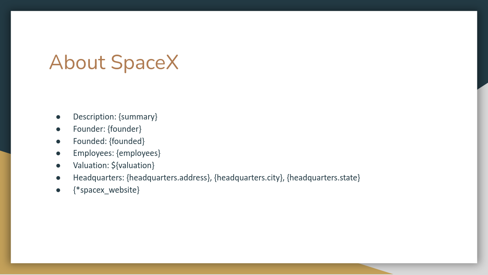

Again, the placeholders will be replaced with data by the AOP server. Since the data given to the AOP server will be in JSON-format (see [Process input data](#process-input-data)), it is possible to reach a subfield of an entry by using `entry.subfield`. So if `headquarters` is a JSON object like this:
```json
"headquarters": {
    "address": "",
    "city": "",
    "state": ""
}
```
we can access the field `address` by doing `headquarters.address`, as can be seen on the slide. Lastly, we again use a hyperlink tag {*spacex_website}. The other tags are 'normal' tags in the sense that they will just be replaced by a value.

Now that the general information is provided in the presentation, we want some slides with information about the rockets, dragons, launch pads, landing pads and ships. This is shown in the next sections.

### Rockets
First we want to have a general slide for the rockets with a description:

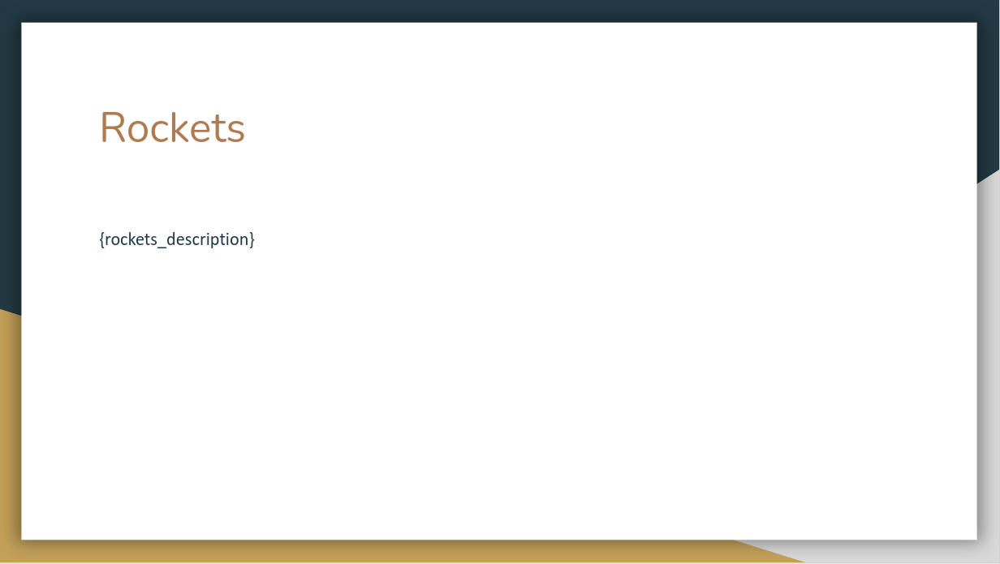

Then we want to have a slide for each rocket with information about this rocket. Since all rockets have the same parameters (such as height, diameter, mass etc.), we want to specify one template slide and use this for each rocket. This template slide looks like this:

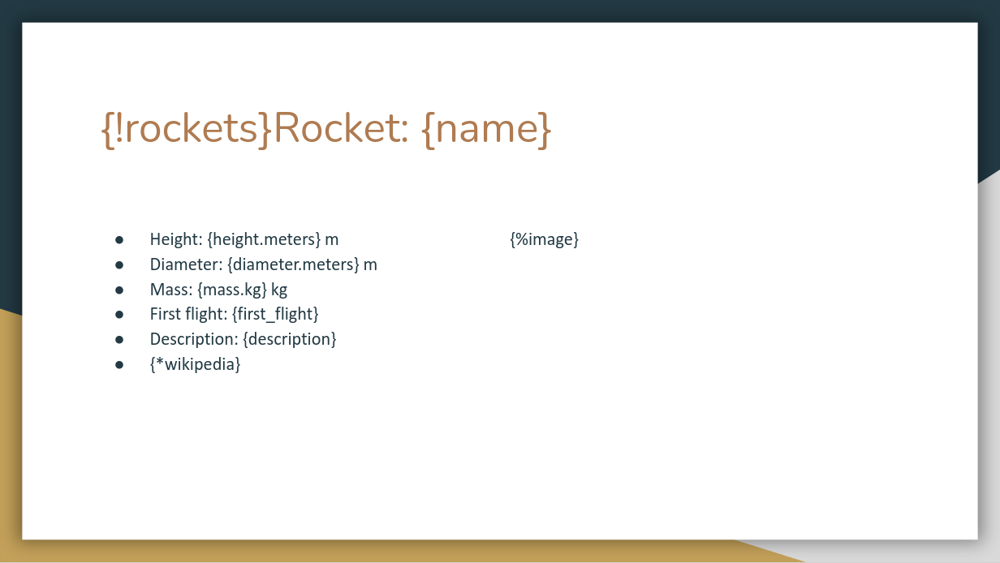

The thing of replicating a certain template slide for each object in a list is exactly what the first tag `{!rockets}` is for. For each rocket in the rockets-array (provided in the data, see [Process input data](#process-input-data)), this slide is repeated. Another new tag is the `{%image}`-tag. This tag is used to insert an image at this place. We have already covered the other types of tags on this slide.

It might be interesting to plot the cost per launch for each of the rockets on a chart. This is the slide used for that:

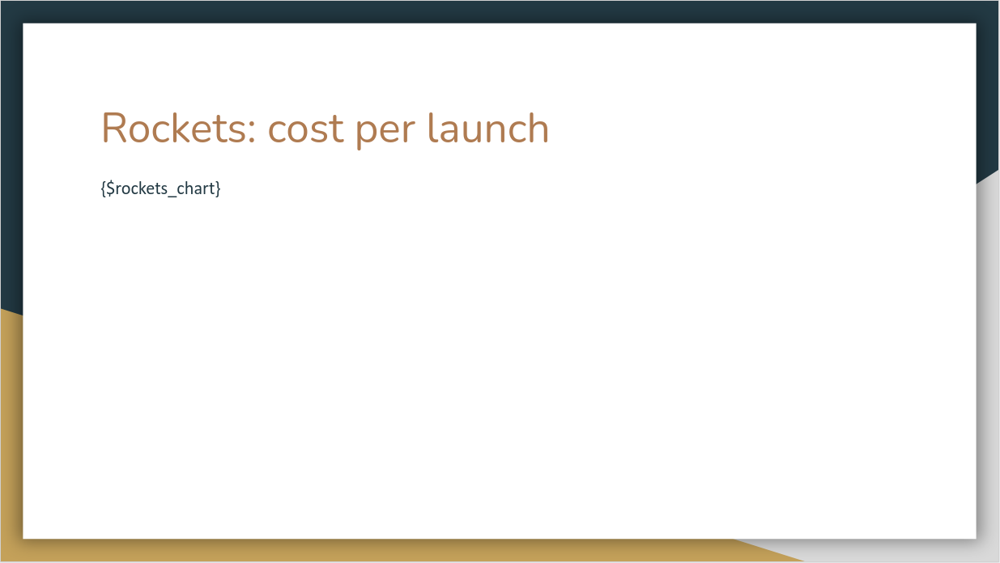

The tag `{$rockets_chart}` is used to insert a chart at the place of this placeholder. The data for the chart can be generated using the Python SDK.

### Dragons
Similar to the section [Rockets](#rockets), we can add the slides for the SpaceX-dragons. The slides used are:

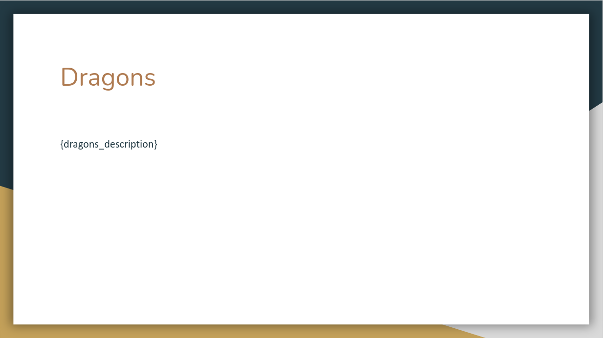

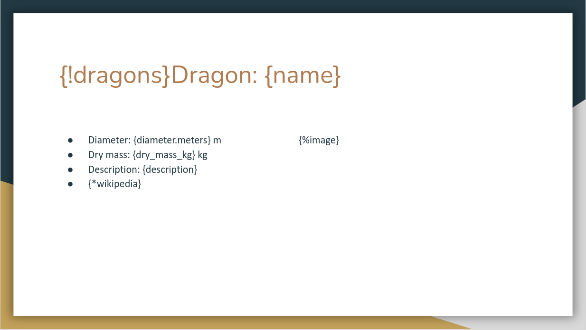

### Launch pads
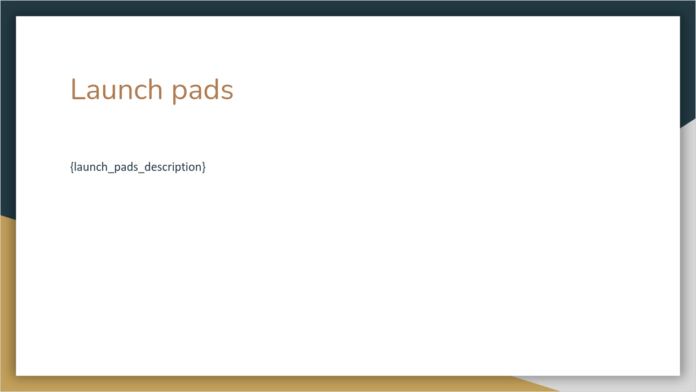

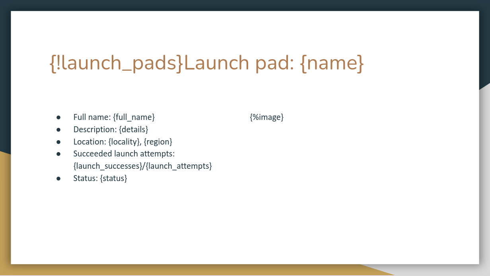

### Landing pads
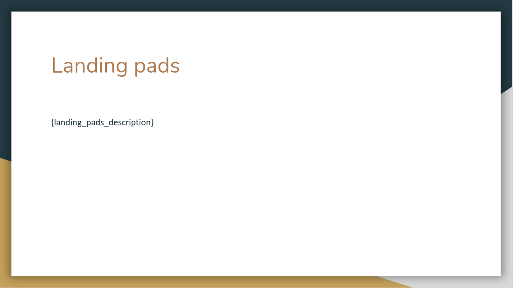

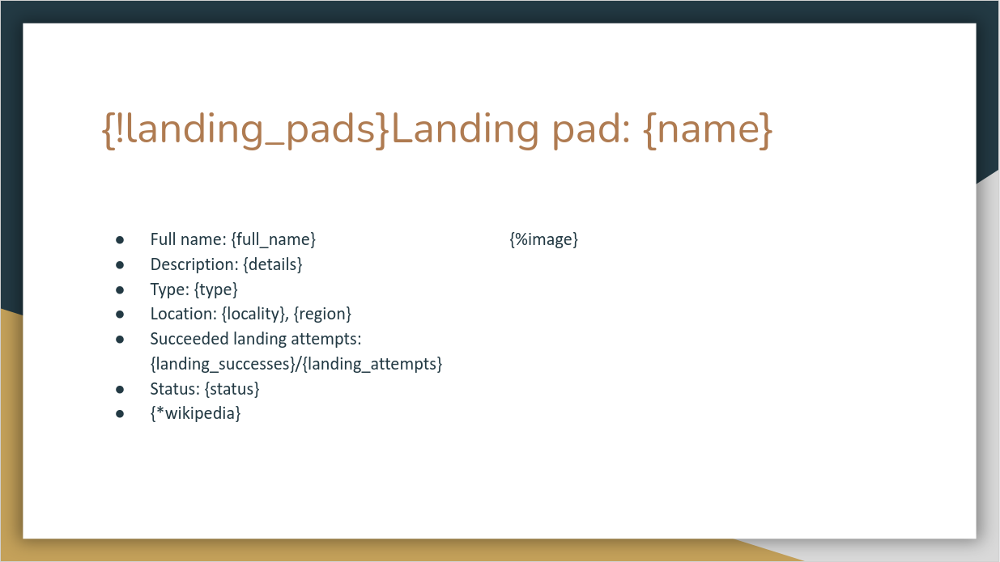

### Ships


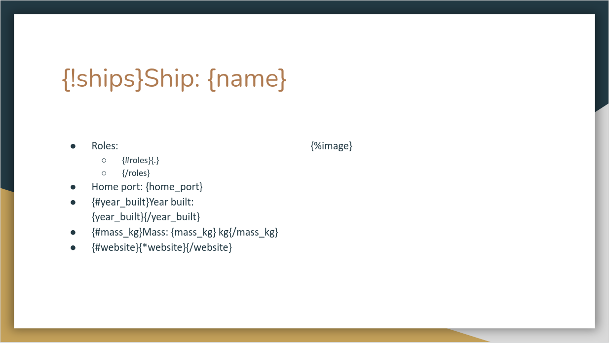

On the last slide we have to make some notes. A ship can have multiple roles, so we loop through these roles by using the loop tag: `{#roles}...{/roles}`, with 'roles' the name of the array in the data. Since in this case 'roles' is an array containing values (see [Ships](#ships)), we can insert those values using `{.}`. If we have an array containing objects with keys and values, we could access those values by using `{key}` instead of `{.}` between the opening and closing loop tags.

We also use a few condition-tags. These tags are used to only show what is between the opening and closing condition-tag if the condition is true. The tags used are the opening tag `{#condition}` and the closing tag `{/condition}`. The condition tags on this slide are: `{#year_built}...{/year_built}`, `{#mass_kg}...{/mass_kg}` and `{#website}...{/website}`.

# Process input data (Python SDK)
Now that our template is finished, we have to process the data used by the template. That is where the Python SDK comes into play. In this section we will explain in detail all the Python code needed to generate the data to fill in the template.


# AOP server and response
